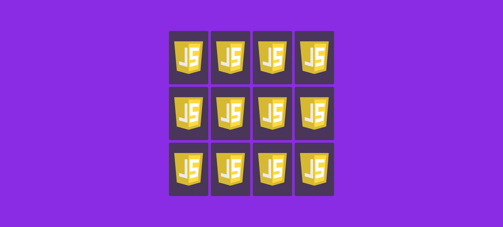
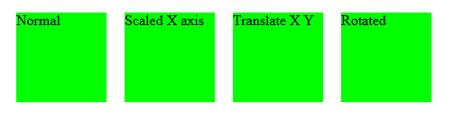
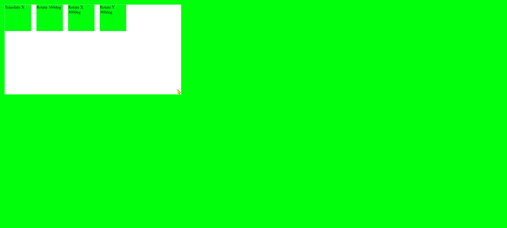

# Jeu de mémoire (JS CSS HTML)

<br>

https://myjeudememoire.netlify.app/

---

## C S S revision

1. **Border-sizing** <br>
```css
.box1{
    width: 600px;
    height: 300px;
    background-color: blueviolet;
    padding: 10px;
}
.box2{
    width: 600px;
    height: 300px;
    background-color: red;
    padding: 40px;
    box-sizing: border-box; /*content shrink from border */
}
```
before <br>
<br>
after <br>
<br>

2. **Position**
```css
.parent{
    position: relative;
}
.child1{
    position: absolute;
    top: 0;
    right: 0;
}
```
<br>

3. **Transition** <br>
transition: [transition-property] [transition-duration] [transition-timing-function] [transition-delay];
NOT = width : auto, display : none

```css
.two{
    transition: transform 0.5s;
}
.two:hover{
/* transform: scale(1.5);  x y axis */
    transform: scale(1.1, 1);/*x axis only*/
}
.three{
    transition: 0.5s;
}
.three:hover{
    transform: translate(10px, 10px);
}
.four{
    transition: transform 0.5s;
}
.four:hover{
    transform: rotate(10deg);
}
```

<br>

4. **Transform**
```css
.one:hover{
            transform: translateX(100px);
            transition: 2s;
        }
        .two:hover{
            transform: rotate(360deg);
            transition: 2s;
        }
        .three:hover{
            transform: rotateX(360deg);
            transition: 2s;
        }
        .four:hover{
            transform: rotateY(360deg);
            transition: 2s;
        }
```
<br>

---
---
<details open>
    <summary> CSS story ?</summary>
    <br>
    
**Global Styles**

    This section applies to all elements on the page. It removes default browser padding and margin, and box-sizing: border-box ensures that padding and borders are included within an element's specified width and height, simplifying layout calculations.

**Body Styling**

    The body is set to take up the full height of the viewport (100vh) and has a blueviolet background. display: flex makes it a flex container, which is often used to easily center content within the body.

**Memory Game Container**

    This defines the main container for the memory game cards. It's a fixed-size square (640px by 640px) that's centered horizontally (margin: auto when display: flex is on the parent body). It's also a flex container that allows its items (.memory-card) to wrap to the next line, creating a grid-like layout. perspective: 1000px is crucial for 3D transformations, giving a sense of depth when cards flip.

**Memory Card Styling**

    This styles each individual memory card:

    Sizing and Spacing (d): Each card takes up roughly 25% of the width and 33.333% of the height of the .memory-game container, with 10px subtracted for margins. The margin: 5px creates spacing around each card.
    Positioning (c): position: relative is set so that its child elements (the front and back faces) can be absolutely positioned relative to the card itself.
    Initial State & Hover Effect (d): transform: scale(1) is the default size. When a card is :active (clicked or touched), it slightly shrinks (scale(0.97)) with a quick transition, providing visual feedback.
    3D Transformations (e 3d):
        transform-style: preserve-3d ensures that child elements (faces) participate in the 3D space.
        transition: transform .5s makes any transform changes (like flipping or scaling) happen smoothly over half a second.
    Flipping: When the .flip class is added (presumably by JavaScript), the card rotates 180 degrees around its Y-axis, creating the flip animation.

**Card Faces Styling**

    This styles the two sides of each card:

    Both faces take up 100% of the card's width and height and are position: absolute so they overlap exactly. They have padding, rounded corners, and a dark purple background.
    backface-visibility: hidden (f): This is crucial for the flip animation. It hides the back of an element when it's rotated away from the viewer. This means when the .front-face is showing, you don't see the .back-face peeking through the "backside" of the .front-face, and vice-versa.
    Initial Front Face Rotation (g): The .front-face is initially rotateY(180deg). This means it starts flipped over, so when the card itself is not flipped (transform: rotateY(0deg)), you see the .back-face. When the card is flipped (transform: rotateY(180deg)), the .front-face will rotate back into view.

    In Summary

    This CSS code sets up a responsive memory game layout using Flexbox for arrangement and sophisticated 3D transform properties (like rotateY, perspective, transform-style, and backface-visibility) to create smooth, realistic card-flipping animations. It handles the initial layout, spacing, and the visual feedback for clicking cards, preparing the stage for JavaScript to control the actual game logic and add/remove the .flip class.

</details>

## **C S S**
```css
/* Universal Box Model Reset */
* {
  padding: 0;
  margin: 0;
  box-sizing: border-box;
}

/* Body Styling for Centering */
body {
  height: 100vh;
  background-color: blueviolet;
  display: flex;
}

/* Memory Game Container Layout and Sizing */
.memory-game {
  width: 640px;
  height: 640px;
  margin: auto;
  display: flex;
  flex-wrap: wrap;
  perspective: 1000px; /* Establishes a 3D perspective for child elements */
}

/* Individual Memory Card Sizing, Positioning, and 3D Transforms */
.memory-card {
  width: calc(25% - 10px);
  height: calc(33.333% - 10px);
  margin: 5px;
  position: relative;
  transform: scale(1);
  transform-style: preserve-3d; /* Ensures children are positioned in 3D space */
  transition: transform 0.5s; /* Smooth transition for transform properties */
}

/* Active State for Memory Cards (Click/Tap Effect) */
.memory-card:active {
  transform: scale(0.97);
  transition: transform 0.2s;
}

/* Flip Animation for Memory Cards */
.memory-card.flip {
  transform: rotateY(180deg); /* Rotates the card to reveal the other side */
}

/* Styling for Front and Back Faces of Memory Cards */
.front-face,
.back-face {
  width: 100%;
  height: 100%;
  padding: 20px;
  border-radius: 5px;
  position: absolute;
  background-color: rgb(73, 54, 91);
  backface-visibility: hidden; /* Hides the back of an element when facing away */
}

/* Initial Orientation of the Front Face */
.front-face {
  transform: rotateY(180deg); /* Starts the front face rotated, so the back face is visible by default */
}
```

---
---

## JavaScript
```js
const cards = document.querySelectorAll('.memory-card');
let hasFlippedCard = false;
let previouslyClickedCard, currentlyClickedCard; 
let lockBoard = false; //5

function flipCard(){
    if(lockBoard) return; //5
    if(this === previouslyClickedCard) return; //6
    this.classList.add('flip');
    if(!hasFlippedCard){
        hasFlippedCard = true; //2 first click
        previouslyClickedCard = this;
        return;
    }
    currentlyClickedCard = this; // second click
    checkForMatch();
}
function checkForMatch(){
    let isMatch = previouslyClickedCard.dataset.framework === currentlyClickedCard.dataset.framework; // 4do cards match
    isMatch ? disableCards(): unflipCards() // 4condition expr1true expr2false
}
function disableCards(){
    previouslyClickedCard.removeEventListener('click', flipCard);
    currentlyClickedCard.removeEventListener('click', flipCard);
    resetBoard(); //7
}
function unflipCards(){
    lockBoard = true; //5
    setTimeout(() =>{
        previouslyClickedCard.classList.remove('flip');
        currentlyClickedCard.classList.remove('flip');
        resetBoard(); //7
    }, 1500);
}
function resetBoard(){ //7
    [hasFlippedCard, lockBoard] = [false, false];
    [previouslyClickedCard, currentlyClickedCard] = [null, null];
}
(function shuffleCards(){ //8
    cards.forEach(card => {
        let randomPosition = Math.floor(Math.random() * 12);
        card.style.order = randomPosition;
    })
})();
cards.forEach(card => card.addEventListener('click', flipCard));

// do cards match ?
// console.log(firstCard.dataset.framework)
// 2 console.log({hasFlippedCard, firstCard, message: 'First click'}); @@first click/second 
// 3 console.log(secondCard.dataset.framework); @@second click from data-HTML
```

<details open>
    <summary> JS story ?</summary>
    <br>

    Initialization:
        cards: Selects all game cards.
        hasFlippedCard: false (no card is currently flipped, waiting for the first click).
        firstCard, secondCard: null (no cards selected yet).
        lockBoard: false (the board is not locked, allowing clicks).

    Shuffling (on load):
        (function shuffleCards(){...})();: This immediately shuffles the cards randomly on the board when the page loads by assigning order CSS property to each card.

    Event Listeners:
        cards.forEach(card => card.addEventListener('click', flipCard));: Each card is set up to call the flipCard function when clicked.

    First Card Click (flipCard function):
        A card is clicked.
        if(lockBoard) return;: Board is not locked, so it continues.
        if(this === firstCard) return;: This is the first click, so firstCard is null. It continues.
        this.classList.add('flip');: The clicked card gets the 'flip' CSS class, showing its face.
        if(!hasFlippedCard) is true (because hasFlippedCard is false).
            hasFlippedCard = true;: Now we know one card is flipped.
            firstCard = this;: The clicked card is stored as firstCard.
            return;: The function exits, waiting for the second click.

    Second Card Click (flipCard function):
        Another card is clicked.
        if(lockBoard) return;: Board is not locked, continues.
        if(this === firstCard) return;: If the user clicks the same card again, it returns. Assuming it's a different card, it continues.
        this.classList.add('flip');: The second clicked card also flips.
        if(!hasFlippedCard) is false (because it's now true from the first click).
        secondCard = this;: The newly clicked card is stored as secondCard.
        checkForMatch();: This function is called to see if the two cards match.

    Checking for Match (checkForMatch function):
        let isMatch = firstCard.dataset.framework === secondCard.dataset.framework;: Compares the data-framework attribute of the two flipped cards.
        isMatch ? disableCards() : unflipCards();:
            If isMatch is true (Match Found): disableCards() is called.
                firstCard.removeEventListener(...), secondCard.removeEventListener(...): The matched cards can no longer be clicked.
                resetBoard();: The board state is reset.
            If isMatch is false (No Match): unflipCards() is called.
                lockBoard = true;: The board is locked (prevents further clicks during the unflip animation).
                setTimeout(...): After 1.5 seconds:
                    firstCard.classList.remove('flip'), secondCard.classList.remove('flip'): Both cards flip back face down.
                    resetBoard();: The board state is reset.

    Resetting the Board (resetBoard function):
        [hasFlippedCard, lockBoard] = [false, false];: Resets these flags, preparing for the next pair of clicks.
        [firstCard, secondCard] = [null, null];: Clears the references to the previously flipped cards.

Value Shifting Summary:

    hasFlippedCard: Toggles between false (initial, after reset) and true (after the first card is flipped).
    firstCard, secondCard: Store references to the actual DOM elements of the flipped cards, then reset to null after a match or mismatch.
    lockBoard: true temporarily during the unflipCards() animation to prevent new clicks, then false after reset.
</details>

